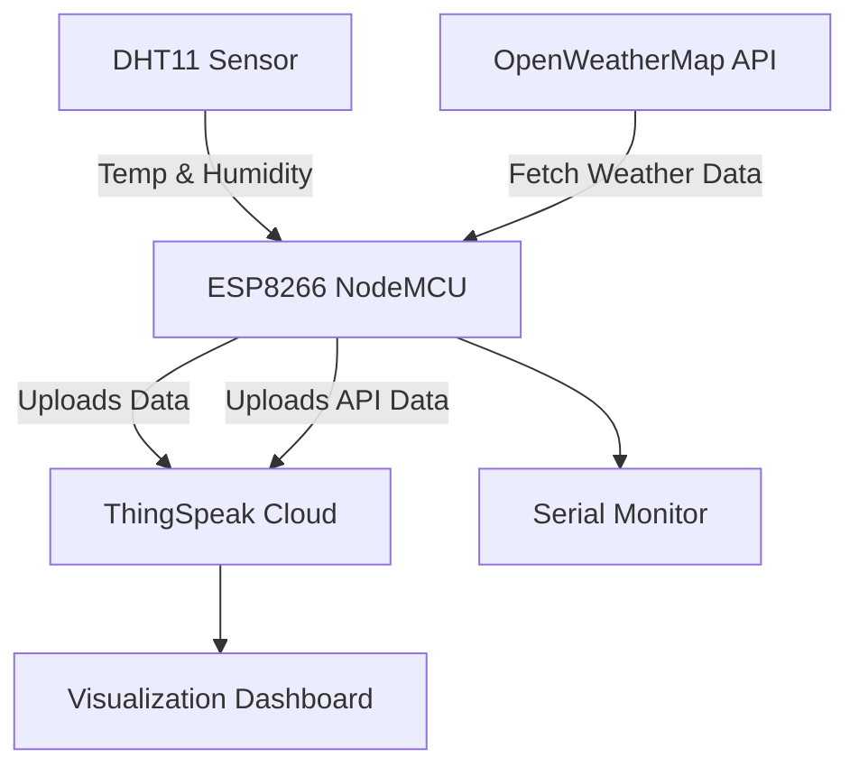

# ESP8266 Weather Station  

An **IoT-based weather monitoring system** built with an **ESP8266**, **DHT11 sensor**, **ThingSpeak Cloud**, and the **OpenWeatherMap API**.  
The project collects local sensor data (temperature & humidity) and combines it with real-time online weather data for visualization on ThingSpeak.  



---

## Project's Output

<p align="center">
  
</p>

---

## Features  
- Reads **temperature and humidity** from a DHT11 sensor.  
- Sends sensor data to **ThingSpeak** for cloud storage & visualization.  
- Fetches **weather data** (temperature, humidity, pressure, wind speed) from OpenWeatherMap API.  
- Uploads both sensor & API data to **ThingSpeak**.  
- Prints all data to the **Serial Monitor** for debugging.  

---

## Hardware Requirements  
- ESP8266 NodeMCU board  
- DHT11 (or DHT22) temperature & humidity sensor  
- Jumper wires & breadboard  
- USB cable for programming  

---

## Libraries Required  
Install the following libraries in the Arduino IDE:  
- `ESP8266WiFi`  
- `ESP8266HTTPClient`  
- `WiFiClient`  
- `Arduino_JSON`  
- `DHT sensor library`  

---

## Wiring  
| DHT11 Pin | ESP8266 Pin |  
|-----------|-------------|  
| VCC       | 3.3V        |  
| GND       | GND         |  
| Data      | D4 (GPIO2)  |  

---

## Setup Instructions  
1. Clone this repository and open the `.ino` file in Arduino IDE.  
2. Update the following credentials in the code:  
   ```cpp
   const char* ssid = "YOUR_WIFI_SSID";
   const char* password = "YOUR_WIFI_PASSWORD";
   const char* writeAPIKey = "YOUR_THINGSPEAK_API_KEY";
   String openWeatherMapApiKey = "YOUR_OPENWEATHERMAP_API_KEY";
   String city = "YOUR_CITY";
   String countryCode = "YOUR_COUNTRY_CODE";
